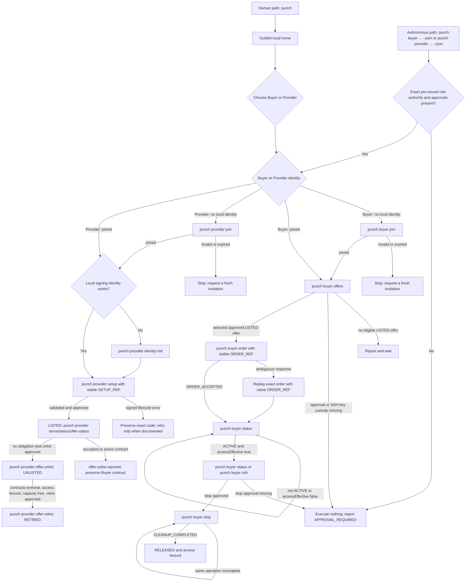

# Punch agent runbook

> **Candidate boundary:** this runbook applies to the gated Preview.12
> candidate. It does not publish or deploy that candidate. The human workflow
> remains [Guided `punch` home](GUIDED_CLI.md); an autonomous agent uses only
> the direct role commands below with `--json`.

An agent starts only with pre-issued, explicitly scoped authority. It must not
launch bare `punch`, answer interactive prompts, mint an invitation, approve a
Provider, select a commercial offer without policy, or acquire wider access.
Role is server-bound: use `punch buyer ...` for a Buyer identity and
`punch provider ...` for a Provider identity.

## Custody and approval boundary

The agent must never read, print, copy into a prompt, or retain an invitation
secret, session token, Provider credential, NetBird setup key, SSH private key,
or raw Control snapshot. It may receive only owner-controlled file paths and
may pass those paths to the documented command. Logs retain sanitized command
arguments, exit status, public identifiers, state, correlation identifiers,
and safe error text only.

Explicit human approval is required unless the launch policy already grants
the exact action and scope:

- custody and one-time use of a Buyer or Provider invitation;
- the privileged NetBird install confirmation used by Buyer `join`;
- Provider setup and Buyer order, including a `$0` pilot, because each creates
  a commercial lifecycle obligation;
- selection or generation of the Buyer's SSH key and use of its public half;
- Buyer `stop`, Provider `offer-unlist`, Provider `offer-retire`, and `drain`.

Missing approval is not a Punch state. The agent executes no lifecycle command,
reports `APPROVAL_REQUIRED` locally, and waits. It must never treat an error,
timeout, empty offer list, or missing local identity as implied approval.

## Buyer direct-command contract

| Action | Required read/input before execution | Expected result | Retry and stop rule |
| --- | --- | --- | --- |
| `punch buyer join --config CONFIG --invitation INVITATION --yes --json` | No valid local session; approved invitation path; approved privileged install if needed; Linux/x64 | joined Buyer session and `netBird: "CONNECTED"` | Use the invitation once. On invalid or expired authority, stop and request a fresh invitation. Never guess or reuse a secret. |
| `punch buyer offers --config CONFIG --json` | Valid local Buyer session | eligible `LISTED` offers or an empty list | Empty means report and wait. Do not order by an undiscoverable ID. |
| `punch buyer order --config CONFIG --offer-id OFFER_ID --order-ref ORDER_REF --ssh-public-key-file PUBLIC_KEY --json` | Selected full `LISTED` offer; exact approved terms; stable `ORDER_REF`; approved public-key path | `ORDER_ACCEPTED` and one contract identifier | After ambiguity, repeat the exact command and payload with the same `ORDER_REF`. Never create a second reference. Changed terms require new approval. |
| `punch buyer status --config CONFIG --job-id JOB_ID --json` | Buyer-owned job identifier returned by `order` | provisioning state, then `ACTIVE` with `accessEffective: true`, or terminal state | Poll with bounded backoff. SSH is forbidden until both `ACTIVE` and `accessEffective: true`. |
| `punch buyer ssh --config CONFIG --job JOB_ID` | `ACTIVE`; `accessEffective: true`; approved private-key custody stays with OpenSSH | byte-stream transport for the documented OpenSSH `ProxyCommand` | A local disconnect does not stop the contract. Never read the private key or bypass the gateway. |
| `punch buyer stop --config CONFIG --job JOB_ID --json` | Buyer-owned job; exact stop approval or pre-authorized policy | `SUCCEEDED`, then `CLEANUP_COMPLETED`, capacity `RELEASED`, access ineffective/fenced | Exact retry is safe for the same job and returns the same operation. Never substitute Provider/admin cleanup. |

The Buyer must preserve `ORDER_REF`, contract/job identifier, and stop
operation/correlation identifiers until the terminal receipt is known.

## Provider direct-command contract

| Action | Required read/input before execution | Expected result | Retry and stop rule |
| --- | --- | --- | --- |
| `punch provider join --invitation INVITATION --punch-origin ORIGIN --credential-file CREDENTIAL --json` | No valid Provider credential; approved invitation path and destination | joined Provider credential | Use a single invitation once. Invalid/expired authority means stop and request a new invitation. |
| `punch provider inventory --json` | Local host custody | bounded local inventory | Read-only; do not infer offer approval from inventory. |
| `punch provider identity-init --state-dir STATE_DIR --machine-id MACHINE_ID --json` | Approved machine ID; protected state directory; no conflicting identity | local signing identity and public fingerprint | Never inspect or export the private signing key. A conflict is terminal pending operator review. |
| `punch provider setup --machine-id MACHINE_ID --state-dir STATE_DIR --agent-config AGENT_CONFIG --idempotency-key SETUP_REF ... --json` | Signed identity; approved capacity/price/Buyer binding; exact setup authorization; stable `SETUP_REF` | setup receipt, then owned offer `LISTED` only after validation/approval | Repeat only the exact request with the same `SETUP_REF`. Never alter terms after ambiguity. |
| `punch provider serve --machine-id MACHINE_ID --state-dir STATE_DIR --agent-config AGENT_CONFIG --interval-ms N` | Valid credential, signing identity, approved config, operator process policy | resident outbound Provider loop | Restart using the same state. Do not launch a duplicate agent for the same machine. |
| `punch provider status --state-dir STATE_DIR --machine-id MACHINE_ID --json` | Owned local state | current local Provider status | Read-only. Preserve safe error output. |
| `punch provider offer-status --machine-id MACHINE_ID --state-dir STATE_DIR --agent-config AGENT_CONFIG --offer-id OFFER_ID --json` | Owned offer ID | `LISTED`, `UNLISTED`, or `RETIRED` plus capacity/guard state | Read-only. A missing or non-owned offer is not permission to mutate it. |
| `punch provider offer-unlist --machine-id MACHINE_ID --state-dir STATE_DIR --agent-config AGENT_CONFIG --offer-id OFFER_ID --idempotency-key KEY --json` | Explicit approval; offer still `LISTED`; no accepted/active obligation | `UNLISTED` | Exact `KEY` replay is safe. Rejection while a contract is active is terminal; the agent must not stop or invalidate the Buyer contract. |
| `punch provider offer-retire --machine-id MACHINE_ID --state-dir STATE_DIR --agent-config AGENT_CONFIG --offer-id OFFER_ID --idempotency-key KEY --json` | Explicit approval; offer `UNLISTED`; all contracts terminal; access fenced; capacity free | `RETIRED` | Exact `KEY` replay is safe. Never retire `LISTED` capacity or an active obligation. |
| `punch provider drain --state-dir STATE_DIR --json` | Explicit maintenance approval | local drain intent | Keep serving until no active lease remains; drain is not Buyer stop. |

For a signed lifecycle failure, preserve the returned JSON `code` and safe
message exactly. Retry only when the documented response says it is retryable
and only with the same operation/idempotency key. If the CLI returns no stable
code, the agent records that limitation and stops instead of inferring one.

## Conditional state machine

## Evidence boundary

The disposable autonomous acceptance for this candidate proves real direct
Buyer and Provider command execution, approval/authority denials, idempotent
order/stop/unlist/retire behavior, and terminal cleanup. It intentionally does
not repeat NetBird enrollment or SSH. The prior Preview.11 acceptance is the
separate real NetBird/SSH data-plane proof and does not prove this candidate's
guided UI network path.
