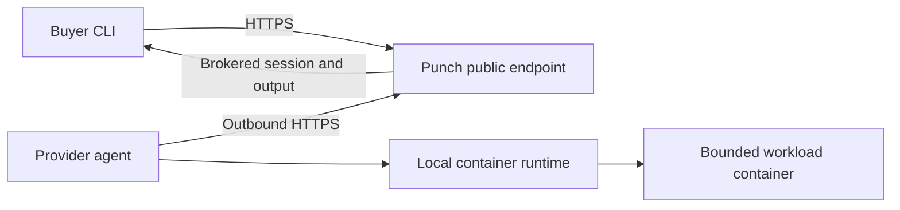

# Architecture

Punch CLI is a thin public client for the Punch control plane. It does not contain the marketplace, scheduler, database, settlement system, or administrator tooling.

## Buyer boundary

- The supported Buyer configuration contains only the public Punch hostname.
- Punch brokers interactive sessions and output retrieval.
- The Buyer does not receive a provider IP address, host credential, container-runtime endpoint, or Docker socket.

## Provider boundary

- The resident agent runs on the local execution node. Punch does not require or expose whether that node is bare metal or a virtual machine.
- The agent inventories only resources visible locally and connects outbound to Punch.
- Workloads run in allowlisted, immutable images with bounded structured inputs.
- The provider's container runtime remains local and is never exposed to Buyers.

## Workload lifecycle

1. A Provider proves it can allocate the offered capacity.
2. Punch validates the offer; listing it does not start paid time.
3. A Buyer creates an idempotent order.
4. The Provider prepares and starts the bounded container.
5. The lifecycle records paid time only after Punch verifies `READY`, exactly once; commercial terms remain authoritative for charges.
6. Punch brokers access while the job is active.
7. Punch Control directs terminal cleanup: the Provider removes the workload container, temporary network and files, and releases the resource lease.
8. Punch records one terminal outcome and reconciles the applicable payment path.

The CLI reports lifecycle state but does not itself hold funds or decide administrative disputes. The public Buyer command surface has no `stop` or `cancel` operation: closing a brokered OpenSSH client does not direct step 7.

An exact-runtime/private canary may demonstrate Control-directed access and
terminal cleanup in its own bounded environment. It is not proof that the
public CLI has a Buyer-stop workflow, that an external Provider/Buyer path is
live, or that testnet/real-USDC settlement occurred.
