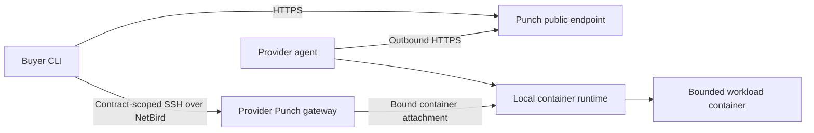

# Architecture

Punch CLI is a thin public client for the Punch control plane. It does not contain the marketplace, scheduler, database, settlement system, or administrator tooling.

## Buyer boundary

- The supported Buyer configuration contains only the public Punch hostname.
- Punch authorizes interactive sessions and output retrieval. NetBird supplies
  encrypted peer connectivity or relay fallback; it is not marketplace or
  lifecycle authority.
- The Buyer receives no public Provider address, host SSH credential,
  container-runtime endpoint, or Docker socket.

## Provider boundary

- The resident agent runs on the local execution node. Punch does not require or expose whether that node is bare metal or a virtual machine.
- The agent inventories only resources visible locally and connects outbound to
  Punch. NetBird also connects outbound; no public Provider SSH port is needed.
- Workloads run in allowlisted, immutable images with bounded structured inputs.
- The provider's container runtime remains local and is never exposed to Buyers.

## Workload lifecycle

1. A Provider proves it can allocate the offered capacity.
2. Punch validates the offer; listing it does not start paid time.
3. A Buyer creates an idempotent order.
4. The Provider prepares and starts the bounded container.
5. The lifecycle records paid time only after Punch verifies `READY`, exactly once; commercial terms remain authoritative for charges.
6. Punch grants a contract-generation-bound NetBird gateway only after the
   workload and gateway are ready.
7. Punch Control directs terminal cleanup: the Provider removes the workload container, temporary network and files, and releases the resource lease.
8. Punch records one terminal outcome and reconciles the applicable payment path.

The CLI reports lifecycle state but does not hold funds or decide administrative
disputes. Preview.9 releases `punch-buyer stop`: it fences access before cleanup,
closes active gateway sessions, and reconciles one durable cleanup operation.
Closing OpenSSH alone still does not direct step 7.

Preview.9 has one owner-operated Provider-to-Buyer lifecycle proof. It does not
prove payment settlement, refunds, arbitrary external Providers, broad
concurrency, or general availability.
