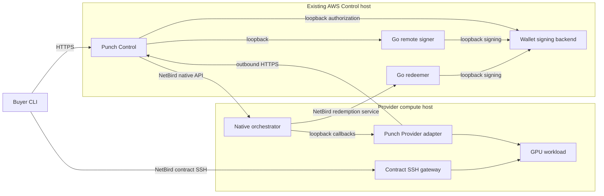

# Livepeer production operations

This guide describes the owner-operated deployment verified on 14 September
2026. It does not turn the invitation-only preview into self-service paid access.
[Install the published CLI](INSTALL.md) only from a verified release archive.
The CLI does not carry a wallet, keys, Go remote signer, or native orchestrator.

## Components and connectivity

AWS services use separate systemd identities and restricted paths; this verified
deployment does not require Docker containers on AWS. Signer and wallet APIs
stay on loopback. Only the required native API and redemption service routes are
allowed over NetBird. Provider administration and Buyer workload access are
separate authorities. No Mac, engineering-host bridge, or public administration
SSH forwarding is required for these runtime paths.

The Provider keeps its existing node identity, native configuration and wallet.
Attaching an existing node does not bootstrap or upgrade that node. Retain the
Provider and NetBird services when removing temporary support SSH access.

## Capability, offer, and price

A capability identifies the service. An offer specifies the resources, duration,
and commercial terms for a purchase. The operator can change prices for new
purchases; already accepted terms remain bound to their accepted digest.

Native discovery supports USD prices using the node's USD/ETH feed, or an integer
fixed price in wei. Punch payment plans express `totalMinor` and `upfrontMinor`
in USD cents with an explicit `quote.weiPerUsd`, `quotedAt`, and `expiresAt`.
There is no automatic native-price-to-Punch-offer synchronization or automatic
Punch quote refresh established by this deployment. The accepted offer, conversion
quote, recipient, and native fixed quote must agree before payment is authorized.

The accepted guaranteed upfront configuration uses `UPFRONT`, with upfront equal
to total, `nativeBinding.winProbabilityPpm: 1000000`, and a single-shot fixed-wei
payment binding. Its native ticket face value equals the agreed expected value;
its winning probability is maximal. Node-level `-ticketEV` and `-maxFaceValue`
settings can match for this bounded configuration; they do not automatically
reprice each offer and must not be changed underneath accepted orders.

## Payment and compute

1. Control accepts the offer's exact terms and checks the configured provider,
   recipient, quote, and spending authorization.
2. The remote signer requests a signature from the wallet backend. The wallet
   permits only the approved operation within its limits; keys stay with custody.
3. Control sends the signed ticket to the native orchestrator. Verified ticket
   acceptance allows compute admission; compute does not wait for redemption.
4. The covered execution admission reuses that payment authorization without a
   second charge. Buyer STOP fences access and releases the allocated capacity.

A 100% winning ticket is not proof that an on-chain redemption transaction has
completed. The orchestrator may redeem later. Expected value, accepted ticket
value, and realized on-chain value remain distinct.

The final real acceptance exercised one guaranteed upfront ticket, GPU execution,
matching downloaded artifact, and STOP with denied subsequent SSH and released
capacity. It did not establish a live series of scheduled installment payments,
redemption completion, or unrestricted paid onboarding. Scheduling support is
not a substitute for that separate acceptance proof.

## Funding and authorization

Wallet ETH for gas and TicketBroker deposit/reserve are separate balances.
Adding funds does not raise an approved job budget, renew an expired quote, or
change the recipient. The current wallet policy does not permit arbitrary
transactions; this guide does not claim automatic wallet or broker top-up.
Configure new offers and bounded payment authority through the existing operator
workflow. Never send private keys, credentials, or wallet configuration in chat.

## Release and rollback boundary

The published CLI `v0.1.0-preview.19.6` predates the later service changes below.
Its public archive is not the later custom Provider bundle. Matching a displayed
preview version alone is insufficient: verify each service's source and artifact
checksum against its deployment receipt before upgrading or testing.

| Component | Accepted source revision |
| --- | --- |
| Control | `829a53c952d8cd18481f3c240fea305e6da4d340` |
| Provider | `f1e9dfb82aa923a252f44aeb341b9e1b1042a3ae` |
| AWS wallet backend | `c6315a13550e2433982ff8b7f0e022d39b966e74` |
| Native Go services | `a14f52396afa6b37b884095f8c2b6d8f12ee4d3f` |

The native source is included in the merged [native production changes](https://github.com/its-DeFine/go-livepeer/pull/1).
That merge does not publish a new binary. The older `31bb2224` staging native
release is historical and does not contain the guaranteed-ticket changes.
Later documentation merges do not change the accepted runtime bytes.

Upgrade only the intended component at an idle boundary. Preserve its previous
executable, service unit, configuration, identities, offers and journals. Restore
those component settings for rollback when compatible; never rewind real ticket,
nonce, payment, or chain history. A CLI update alone must not replace a newer
custom Provider or re-enroll the existing peer.
